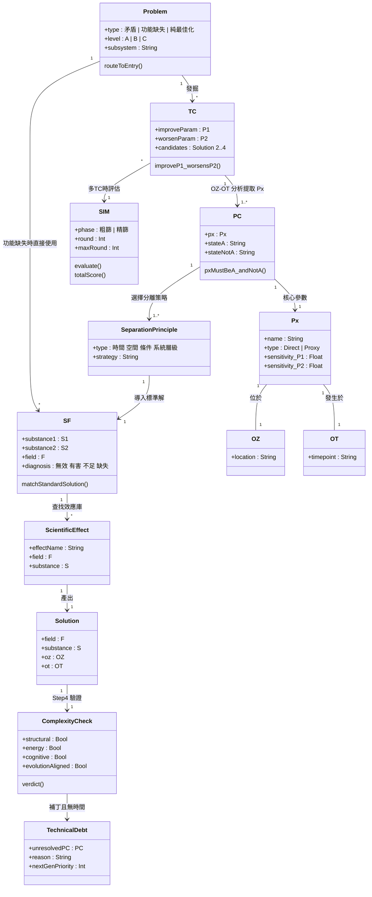

# Auto-TRIZ 核心概念模型 (Domain Class Diagram)

**概念關係說明：**

| 層級 | 工具 | 解析度 | 角色 | 產出 |
|:-----|:-----|:------|:-----|:-----|
| 1 | TC (技術矛盾) | 10x 鏡頭 | 外交官 | 啟發性方向 |
| 2 | PC (物理矛盾) | 100x 鏡頭 | 外科醫生 | 決定性分割策略 |
| 3 | SF (質-場分析) | 手術刀路徑 | 配方工程師 | 具體結構方案 |
