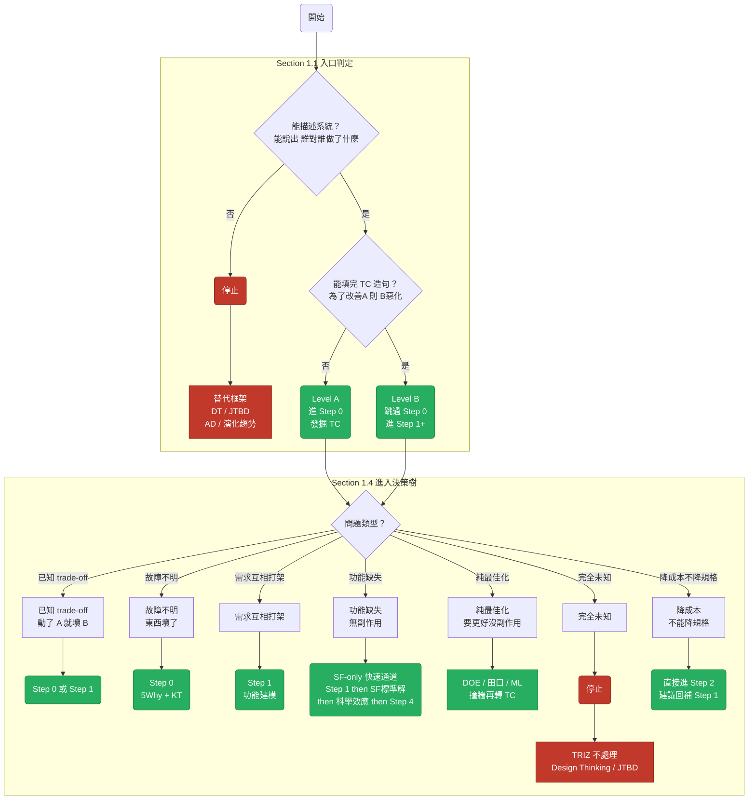

# 入口判定與決策樹 (Section 1.1 + 1.4)

```mermaid
graph TD
    START("開始")

    subgraph S11 [Section 1.1 入口判定]
        Q1{"能描述系統？<br/>能說出 誰對誰做了什麼"}
        Q2{"能填完 TC 造句？<br/>為了改善A 則 B惡化"}
        STOP_C("停止"):::red
        ALT_C["替代框架<br/>DT / JTBD<br/>AD / 演化趨勢"]:::red
        LEVEL_B("Level B<br/>跳過 Step 0<br/>進 Step 1+"):::green
        LEVEL_A("Level A<br/>進 Step 0<br/>發掘 TC"):::green

        Q1 -->|否| STOP_C
        STOP_C --> ALT_C
        Q1 -->|是| Q2
        Q2 -->|是| LEVEL_B
        Q2 -->|否| LEVEL_A
    end

    subgraph S14 [Section 1.4 進入決策樹]
        Q_TYPE{"問題類型？"}

        TRADEOFF["已知 trade-off<br/>動了 A 就壞 B"]
        FAULT["故障不明<br/>東西壞了"]
        CONFLICT["需求互相打架"]
        FUNC_MISS["功能缺失<br/>無副作用"]
        OPTIMIZE["純最佳化<br/>要更好沒副作用"]
        UNKNOWN["完全未知"]
        COST_DOWN["降成本<br/>不能降規格"]

        STEP01("Step 0 或 Step 1"):::green
        STEP0_5WHY("Step 0<br/>5Why + KT"):::green
        STEP1_FUNC("Step 1<br/>功能建模"):::green
        SF_FAST("SF-only 快速通道<br/>Step 1 then SF標準解<br/>then 科學效應 then Step 4"):::green
        DOE_ML["DOE / 田口 / ML<br/>撞牆再轉 TC"]:::green
        STOP_DT("停止"):::red
        ALT_DT["TRIZ 不處理<br/>Design Thinking / JTBD"]:::red
        STEP2("直接進 Step 2<br/>建議回補 Step 1"):::green

        Q_TYPE -->|已知 trade-off| TRADEOFF --> STEP01
        Q_TYPE -->|故障不明| FAULT --> STEP0_5WHY
        Q_TYPE -->|需求互相打架| CONFLICT --> STEP1_FUNC
        Q_TYPE -->|功能缺失| FUNC_MISS --> SF_FAST
        Q_TYPE -->|純最佳化| OPTIMIZE --> DOE_ML
        Q_TYPE -->|完全未知| UNKNOWN --> STOP_DT
        STOP_DT --> ALT_DT
        Q_TYPE -->|降成本不降規格| COST_DOWN --> STEP2
    end

    START --> Q1
    LEVEL_A --> Q_TYPE
    LEVEL_B --> Q_TYPE

    classDef red  fill:#c0392b,color:#fff,stroke:#922b21
    classDef green fill:#27ae60,color:#fff,stroke:#1e8449
```
