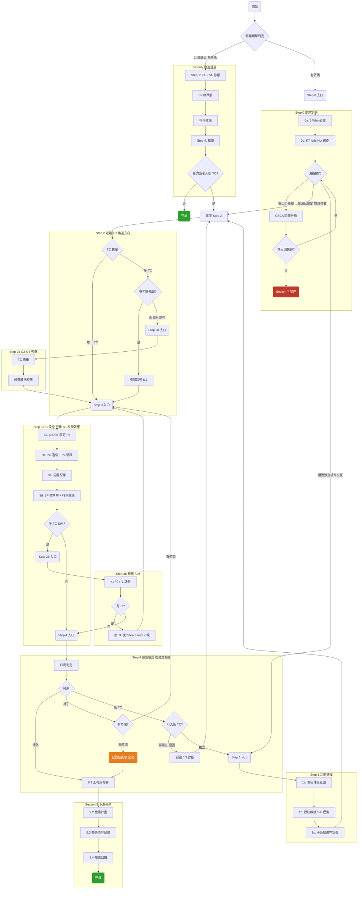

# 閉環推理流程 — 主流程圖 (Section 2)

```mermaid
graph TD
    START(開始) --> ENTRY{問題類型判定}

    subgraph "SF-only 快速通道"
        SF1[Step 1: FA + SF 診斷]
        SF2[SF 標準解]
        SF3[科學效應]
        SF4[Step 4: 驗證]
        SF_GATE{新方案引入新 TC?}
        SF1 --> SF2 --> SF3 --> SF4 --> SF_GATE
    end

    ENTRY -->|功能缺失 無矛盾| SF1
    SF_GATE -->|否| DONE(完成)
    SF_GATE -->|是| S2_ENTRY

    style DONE fill:#2d9e2d,color:#fff,stroke:#1a7a1a

    ENTRY -->|有矛盾| S0_START

    subgraph "Step 0 問題定向"
        S0a[0a. 5 Why 必做]
        S0b[0b. KT Is/Is Not 選配]
        S0_GATE{決策閘門}
        S0_CECA[CECA 因果分析]
        S0_CHAIN{產出因果鏈?}
        S0a --> S0b --> S0_GATE
        S0_GATE -->|根因仍模糊| S0_CECA
        S0_CECA --> S0_CHAIN
        S0_CHAIN -->|否| STOP(Section 7 喊停)
        S0_CHAIN -->|是| S0_GATE
    end

    style STOP fill:#c0392b,color:#fff,stroke:#922b21

    S0_START(Step 0 入口) --> S0a
    S0_GATE -->|根因已鎖定 物理參數| S2_ENTRY[跳至 Step 2]
    S0_GATE -->|根因涉及組件交互| S1_START

    subgraph "Step 1 功能建模"
        S1a[1a. 畫組件交互圖]
        S1b[1b. 對紅線建 S-F 模型]
        S1c[1c. 子系統邊界定義]
        S1a --> S1b --> S1c
    end

    S1_START(Step 1 入口) --> S1a
    S1c --> S2_ENTRY

    subgraph "Step 2 定義 TC 候選方向"
        S2_GATE{TC 數量}
        S2_BOTTLENECK{有明顯瓶頸?}
        BOTTLE_PATH[瓶頸路徑 5.1]
        S2_GATE -->|單一 TC| S3_ENTRY
        S2_GATE -->|多 TC| S2_BOTTLENECK
        S2_BOTTLENECK -->|是| BOTTLE_PATH
        S2_BOTTLENECK -->|否 SIM 路徑| S2B_ENTRY
    end

    S2_ENTRY --> S2_GATE
    BOTTLE_PATH --> S3_ENTRY

    subgraph "Step 2b OZ OT 預篩"
        S2B1[TC 去重]
        S2B2[候選解法粗篩]
        S2B1 --> S2B2
    end

    S2B_ENTRY(Step 2b 入口) --> S2B1
    S2B2 --> S3_ENTRY

    subgraph "Step 3 PC 深挖 分離 SF 科學效應"
        S3a[3a. OZ-OT 鎖定 Px]
        S3b_pc[3b. PC 造句 + Px 驗證]
        S3c[3c. 分離原理]
        S3d[3d. SF 標準解 + 科學效應]
        S3_GATE{多 TC SIM?}
        S3a --> S3b_pc --> S3c --> S3d --> S3_GATE
        S3_GATE -->|是| S3B_ENTRY
        S3_GATE -->|否| S4_ENTRY
    end

    S3_ENTRY(Step 3 入口) --> S3a

    subgraph "Step 3b 精篩 SIM"
        S3B1[+1 / 0 / -1 評分]
        S3B_GATE{有 -1?}
        S3B_LOOP[新 TC 回 Step 3 max 2 輪]
        S3B1 --> S3B_GATE
        S3B_GATE -->|是| S3B_LOOP
        S3B_GATE -->|否| S4_ENTRY
    end

    S3B_ENTRY(Step 3b 入口) --> S3B1
    S3B_LOOP --> S3_ENTRY

    subgraph "Step 4 原型驗證 複雜度檢查"
        S4_4Q[四問判定]
        S4_EVO{結果}
        S4_PATCH_TIME{有時間?}
        S4_NEW_TC{引入新 TC?}
        S4_DEBT(記錄技術債 出貨)
        S4_LOOP[迴圈 5.3 診斷]
        S4_4Q --> S4_EVO
        S4_EVO -->|進化| S9_SPEC
        S4_EVO -->|補丁| S4_PATCH_TIME
        S4_PATCH_TIME -->|有時間| S3_ENTRY
        S4_PATCH_TIME -->|無時間| S4_DEBT
        S4_EVO -->|新 TC| S4_NEW_TC
        S4_NEW_TC -->|非獨立 迴圈| S4_LOOP
        S4_NEW_TC -->|獨立| S1_START
    end

    style DONE2 fill:#2d9e2d,color:#fff,stroke:#1a7a1a
    style S4_DEBT fill:#e67e22,color:#fff,stroke:#ca6f1e

    S4_ENTRY(Step 4 入口) --> S4_4Q
    S4_LOOP --> S2_ENTRY
    S4_DEBT --> S9_SPEC

    subgraph "Section 9 下游任務"
        S9_SPEC[9.1 工程規格書]
        S9_VERIFY[9.2 驗證計畫]
        S9_DEBT_LOG[9.3 技術債登記簿]
        S9_FEEDBACK[9.4 知識回饋]
        S9_SPEC --> S9_VERIFY --> S9_DEBT_LOG --> S9_FEEDBACK --> DONE2(完成)
    end
```
