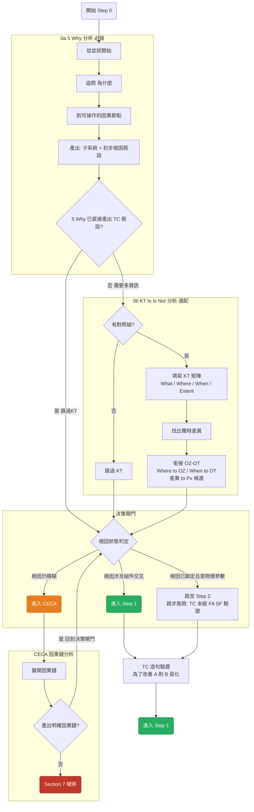

# Step 0: 問題定向與邊界 (Section 3)

```mermaid
graph TD
    START(開始 Step 0)

    subgraph "0a 5 Why 分析 必做"
        A1[從症狀開始]
        A2[追問 為什麼]
        A3[到可操作的因果節點]
        A4[產出: 子系統 + 初步根因假設]
        A5{5 Why 已直接產出 TC 假設?}
        A1 --> A2 --> A3 --> A4 --> A5
    end

    subgraph "0b KT Is Is Not 分析 選配"
        B1{有對照組?}
        B2[填寫 KT 矩陣<br>What / Where / When / Extent]
        B3[找出獨特差異]
        B4[銜接 OZ-OT<br>Where to OZ / When to OT<br>差異 to Px 候選]
        SKIP_KT[跳過 KT]
        B1 -->|否| SKIP_KT
        B1 -->|是| B2 --> B3 --> B4
    end

    subgraph "決策閘門"
        DG1{根因狀態判定}
        DG_S2[跳至 Step 2<br>跳步風險: TC 未經 FA SF 驗證]
        DG_S1(進入 Step 1):::green
        DG_CECA(進入 CECA):::orange
    end

    subgraph "CECA 因果鏈分析"
        C1[展開因果鏈]
        C2{產出明確因果鏈?}
        STOP_7(Section 7 喊停):::red
    end

    TC_VERIFY[TC 造句驗證<br>為了改善 A 則 B 惡化]
    STEP1_END(進入 Step 1):::green

    START --> A1

    A5 -->|是 跳過KT| DG1
    A5 -->|否 需更多資訊| B1

    SKIP_KT --> DG1
    B4 --> DG1

    DG1 -->|根因已鎖定且是物理參數| DG_S2
    DG1 -->|根因涉及組件交互| DG_S1
    DG1 -->|根因仍模糊| DG_CECA

    DG_CECA --> C1 --> C2
    C2 -->|是 回到決策閘門| DG1
    C2 -->|否| STOP_7

    DG_S1 --> TC_VERIFY
    DG_S2 --> TC_VERIFY
    TC_VERIFY --> STEP1_END

    classDef red    fill:#c0392b,color:#fff,stroke:#922b21
    classDef green  fill:#27ae60,color:#fff,stroke:#1e8449
    classDef orange fill:#e67e22,color:#fff,stroke:#ca6f1e
```
