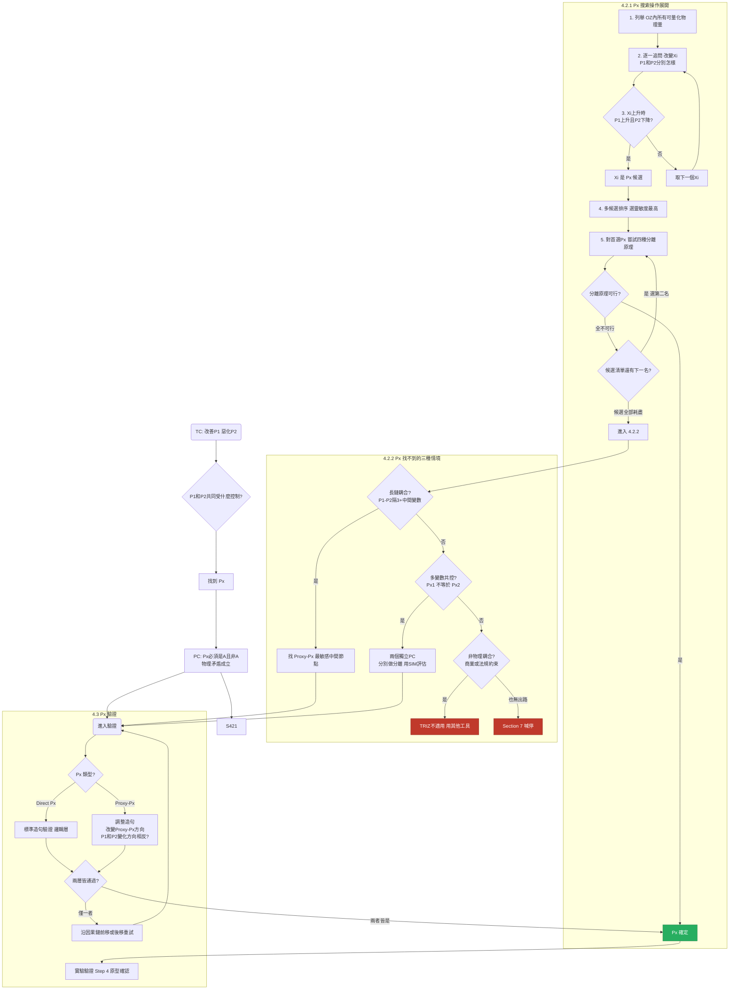

# Px 搜索、驗證與回退機制 (Section 4)

```mermaid
graph TD
    START(TC: 改善P1 惡化P2) --> ASK{P1和P2共同受什麼控制?}
    ASK --> FOUND[找到 Px]
    FOUND --> PC[PC: Px必須是A且非A<br>物理矛盾成立]

    PC --> S421

    subgraph "4.2.1 Px 搜索操作展開"
        OP1[1. 列舉 OZ內所有可量化物理量] --> OP2
        OP2[2. 逐一追問 改變Xi<br>P1和P2分別怎樣] --> OP3
        OP3{3. Xi上升時<br>P1上升且P2下降?}
        OP3 -->|是| OP4
        OP3 -->|否| OP2_NEXT[取下一個Xi]
        OP2_NEXT --> OP2
        OP4[Xi 是 Px 候選] --> OP5
        OP5[4. 多候選排序 選靈敏度最高] --> OP6
        OP6[5. 對首選Px 嘗試四種分離原理] --> SEP_OK{分離原理可行?}
        SEP_OK -->|是| PX_CONFIRMED
        SEP_OK -->|全不可行| RETRY{候選清單還有下一名?}
        RETRY -->|是 選第二名| OP6
        RETRY -->|候選全部耗盡| GOTO422[進入 4.2.2]
    end

    subgraph "4.2.2 Px 找不到的三種情境"
        GOTO422 --> CASE1{長鏈耦合?<br>P1-P2隔3+中間變數}
        CASE1 -->|是| PROXY[找 Proxy-Px 最敏感中間節點]
        CASE1 -->|否| CASE2{多變數共控?<br>Px1 不等於 Px2}
        CASE2 -->|是| DUAL[兩個獨立PC<br>分別做分離 用SIM評估]
        CASE2 -->|否| CASE3{非物理耦合?<br>商業或法規約束}
        CASE3 -->|是| NONTRIZ[TRIZ不適用 用其他工具]:::red
        CASE3 -->|也無出路| STOP_7[Section 7 喊停]:::red
    end

    subgraph "4.3 Px 驗證"
        VAL_START(進入驗證) --> WHICH{Px 類型?}
        WHICH -->|Direct Px| DIRECT[標準造句驗證 邏輯層]
        WHICH -->|Proxy-Px| PROXY_VAL[調整造句<br>改變Proxy-Px方向<br>P1和P2變化方向相反?]
        DIRECT --> BOTH{兩層皆通過?}
        PROXY_VAL --> BOTH
        BOTH -->|兩者皆是| PX_CONFIRMED
        BOTH -->|僅一者| SHIFT[沿因果鏈前移或後移重試]
        SHIFT --> VAL_START
        PX_CONFIRMED[Px 確定]:::green --> PHYS[實驗驗證 Step 4 原型確認]
    end

    PROXY --> VAL_START
    DUAL --> VAL_START
    PC --> VAL_START

    classDef red fill:#c0392b,color:#fff,stroke:#922b21
    classDef green fill:#27ae60,color:#fff,stroke:#1e8449
```
