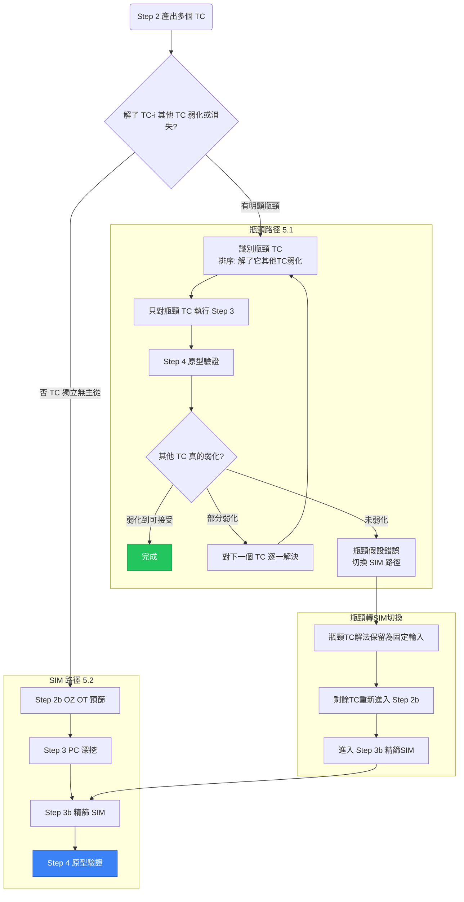

# 多 TC 策略：瓶頸路徑 vs SIM 路徑 (Section 5.0 + 5.1)

```mermaid
graph TD
    START(Step 2 產出多個 TC)
    DECISION{解了 TC-i 其他 TC 弱化或消失?}

    START --> DECISION

    DECISION -->|有明顯瓶頸| B1
    DECISION -->|否 TC 獨立無主從| S1

    subgraph "瓶頸路徑 5.1"
        B1[識別瓶頸 TC<br>排序: 解了它其他TC弱化]
        B2[只對瓶頸 TC 執行 Step 3]
        B3[Step 4 原型驗證]
        B4{其他 TC 真的弱化?}
        B5A[完成]
        B5B[對下一個 TC 逐一解決]
        B5C[瓶頸假設錯誤<br>切換 SIM 路徑]
        B1 --> B2 --> B3 --> B4
        B4 -->|弱化到可接受| B5A
        B4 -->|部分弱化| B5B
        B4 -->|未弱化| B5C
    end

    subgraph "瓶頸轉SIM切換"
        SW1[瓶頸TC解法保留為固定輸入]
        SW2[剩餘TC重新進入 Step 2b]
        SW3[進入 Step 3b 精篩SIM]
        SW1 --> SW2 --> SW3
    end

    subgraph "SIM 路徑 5.2"
        S1[Step 2b OZ OT 預篩]
        S2[Step 3 PC 深挖]
        S3[Step 3b 精篩 SIM]
        S4[Step 4 原型驗證]
        S1 --> S2 --> S3 --> S4
    end

    B5C --> SW1
    SW3 --> S3
    B5B --> B1

    style B5A fill:#22c55e,color:#fff,stroke:#16a34a
    style S4 fill:#3b82f6,color:#fff,stroke:#1d4ed8
```
