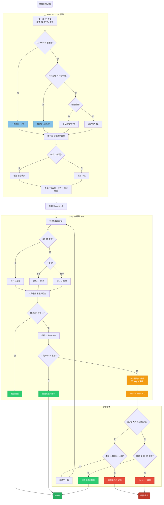

# SIM 迭代流程：預篩 → 精篩 → 收斂 (Section 5.2)

```mermaid
graph TD
    START(開始 SIM 迭代) --> TC_DEDUP

    subgraph "Step 2b OZ OT 預篩"
        TC_DEDUP[第一步 TC 去重<br>檢查 OZ OT Px 重疊]
        TC_DEDUP --> OZ_CHECK{OZ+OT+Px 全重疊?}
        OZ_CHECK -->|是| MERGE_PC[合併為同一 PC]
        OZ_CHECK -->|否| IMPROVE_CHECK{TC-i 惡化 = TC-j 改善?}
        IMPROVE_CHECK -->|是| VERIFY_PX[驗證 Px 後合併]
        IMPROVE_CHECK -->|否| PARTIAL_CHECK{部分重疊?}
        PARTIAL_CHECK -->|是| KEEP_INDEP[保留為獨立 TC]
        PARTIAL_CHECK -->|否| CONFIRM_INDEP[確定獨立 TC]
        MERGE_PC --> CAND_FILTER
        VERIFY_PX --> CAND_FILTER
        KEEP_INDEP --> CAND_FILTER
        CONFIRM_INDEP --> CAND_FILTER
        CAND_FILTER[第二步 候選解法粗篩]
        CAND_FILTER --> SAME_OZ{OZ且OT相同?}
        SAME_OZ -->|是| MARK_CONFLICT[標記 潛在衝突]
        SAME_OZ -->|否| MARK_NEUTRAL[標記 中性]
        MARK_CONFLICT --> PRE_OUTPUT
        MARK_NEUTRAL --> PRE_OUTPUT
        PRE_OUTPUT[產出: TC去重 + 排序 + 衝突標記]
    end

    PRE_OUTPUT --> ROUND_INIT[初始化 round = 1]
    ROUND_INIT --> SCORE_PAIRS

    subgraph "Step 3b 精篩 SIM"
        SCORE_PAIRS[對每對解法評分]
        SCORE_PAIRS --> OZ_OT_OVERLAP{OZ OT 重疊?}
        OZ_OT_OVERLAP -->|否| SCORE_0[評分 0 中性]
        OZ_OT_OVERLAP -->|是| F_COMPAT{F 相容?}
        F_COMPAT -->|相容| SCORE_P1[評分 +1 加成]
        F_COMPAT -->|相斥| SCORE_M1[評分 -1 消弭]
        SCORE_0 --> CALC_SUM
        SCORE_P1 --> CALC_SUM
        SCORE_M1 --> CALC_SUM
        CALC_SUM[計算總分 選最高組合]
        CALC_SUM --> HAS_M1{最優組合存在 -1?}
        HAS_M1 -->|否| PASS_S4[組合通過]
        HAS_M1 -->|是| ANALYZE_M1[分析 -1 的 OZ OT]
        ANALYZE_M1 --> M1_OVERLAP{-1 的 OZ OT 重疊?}
        M1_OVERLAP -->|否| ACCEPT_A[接受為設計限制]
        M1_OVERLAP -->|是| NEW_CONFLICT[-1 = 新跨TC矛盾<br>回 Step 3 深挖]
        NEW_CONFLICT --> INC_ROUND[round = round + 1]
    end

    INC_ROUND --> CHECK_MAX

    subgraph "收斂檢查"
        CHECK_MAX{round 大於 maxRound?}
        CHECK_MAX -->|否| CHECK_TREND{本輪 -1 數量 >= 上輪?}
        CHECK_TREND -->|否| LOOP_BACK[繼續下一輪]
        CHECK_TREND -->|是| DIVERGE[迴圈未收斂 喊停]
        CHECK_MAX -->|是| RESIDUAL{殘餘 -1 OZ OT 重疊?}
        RESIDUAL -->|是| SEC7_STOP[Section 7 喊停]
        RESIDUAL -->|否| ACCEPT_B[接受為設計限制]
    end

    LOOP_BACK --> SCORE_PAIRS

    PASS_S4 --> STEP4_END(Step 4)
    ACCEPT_A --> STEP4_END
    ACCEPT_B --> STEP4_END

    DIVERGE --> HALT(喊停 終止)
    SEC7_STOP --> HALT

    style HALT fill:#c0392b,color:#fff,stroke:#922b21
    style DIVERGE fill:#e74c3c,color:#fff,stroke:#c0392b
    style SEC7_STOP fill:#e74c3c,color:#fff,stroke:#c0392b
    style STEP4_END fill:#27ae60,color:#fff,stroke:#1e8449
    style PASS_S4 fill:#2ecc71,color:#fff,stroke:#27ae60
    style ACCEPT_A fill:#2ecc71,color:#fff,stroke:#27ae60
    style ACCEPT_B fill:#2ecc71,color:#fff,stroke:#27ae60
    style MERGE_PC fill:#85c1e9,stroke:#2e86c1
    style VERIFY_PX fill:#85c1e9,stroke:#2e86c1
    style NEW_CONFLICT fill:#f39c12,color:#fff,stroke:#d68910
    style INC_ROUND fill:#f39c12,color:#fff,stroke:#d68910
```
