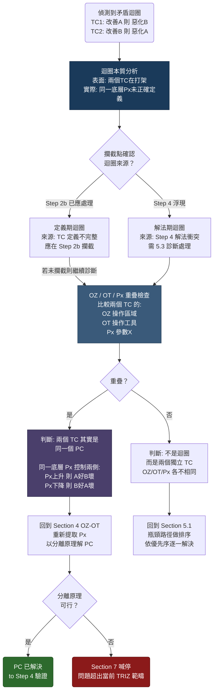

# 矛盾迴圈診斷與處理 (Section 5.3)

## 關鍵洞察

矛盾迴圈 (解A→惡化B→解B→惡化A) **不是新問題類型**，而是 TC 定義不完整的診斷信號。

**早期攔截原則：** 大部分定義期迴圈應在 Step 2b (OZ/OT 預篩 TC 去重) 就被合併為 PC。  
本流程處理：① 漏過預篩的殘餘　② Step 4 才浮現的解法期迴圈

## 迴圈本質

| 層次 | 描述 |
| :--- | :--- |
| **表面** | TC1 改善 A → 惡化 B；TC2 改善 B → 惡化 A（兩個 TC 在打架） |
| **實際** | 同一個底層 Px：Px↑ → A好B壞，Px↓ → B好A壞（一個未被正確定義的 PC） |

## 流程圖

## 攔截點對照表

| 迴圈來源 | 攔截點 |
| :--- | :--- |
| 定義期迴圈 | Step 2b OZ/OT 預篩 |
| 解法期迴圈 | Step 4 → 5.3 診斷 |

## 補充說明

- **OZ/OT 重疊** 是判斷「同一 PC」的核心依據，重疊代表兩個 TC 描述的是同一物理矛盾的兩側。
- **分離原理** 包含時間分離、空間分離、條件分離、系統層次分離，任一可行即可解 PC。
- **Section 7 喊停** 表示當前問題定義框架無法容納此矛盾，需重新 scoping 或提升系統層次。
