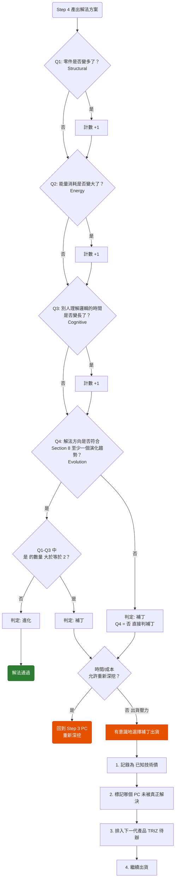

# 複雜度判定：補丁 vs 進化 (Section 6)

## 6.1 四維複雜度指標

| 維度 | 補丁信號 | 進化信號 |
| :--- | :--- | :--- |
| 結構 | 新增零件修正舊零件 | 現有零件多功能化 |
| 能量 | 引入新能量系統 | 利用環境資源替代 |
| 耦合 | 改A連帶影響BCD | 縮短轉換步驟 |
| 理想度 | 分母增長大於分子 | 分母趨近於零 |

---

## 6.2 & 6.3 快速判斷流程圖

> **注意：** 失敗不是選擇補丁，而是把補丁當成永久方案卻不記錄。
