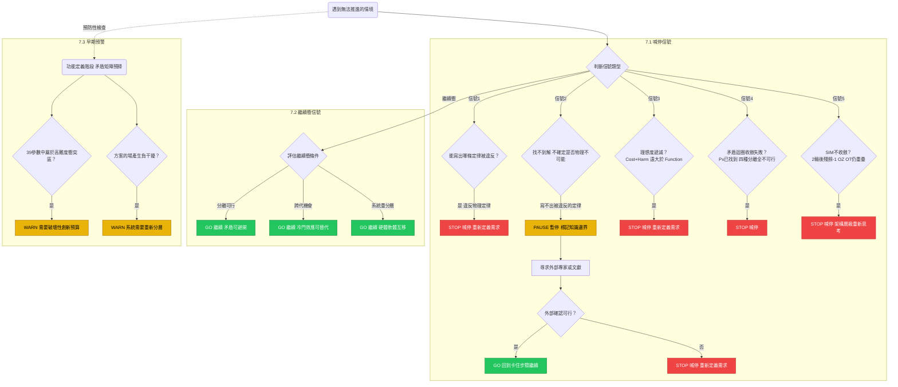

# 喊停 vs 繼續衝 — 決策框架 (Section 7)

```mermaid
graph TD
    START(遇到無法推進的情境) --> SIGNAL_TYPE{判斷信號類型}

    subgraph 7.1 喊停信號
        SIGNAL_TYPE -->|信號1| S1_CHECK{能寫出哪條定律被違反？}
        S1_CHECK -->|是 違反物理定律| STOP1[STOP 喊停 重新定義需求]
        style STOP1 fill:#ef4444,color:#fff,stroke:#b91c1c

        SIGNAL_TYPE -->|信號2| S2_CHECK{找不到解 不確定是否物理不可能}
        S2_CHECK -->|寫不出被違反的定律| PAUSE[PAUSE 暫停 標記知識邊界]
        style PAUSE fill:#eab308,color:#000,stroke:#a16207
        PAUSE --> EXPERT[尋求外部專家或文獻]
        EXPERT --> CONFIRM{外部確認可行？}
        CONFIRM -->|是| BACK_STEP[GO 回到卡住步驟繼續]
        style BACK_STEP fill:#22c55e,color:#fff,stroke:#15803d
        CONFIRM -->|否| STOP2[STOP 喊停 重新定義需求]
        style STOP2 fill:#ef4444,color:#fff,stroke:#b91c1c

        SIGNAL_TYPE -->|信號3| S3_CHECK{理想度遞減？<br>Cost+Harm 遠大於 Function}
        S3_CHECK -->|是| STOP3[STOP 喊停 重新定義需求]
        style STOP3 fill:#ef4444,color:#fff,stroke:#b91c1c

        SIGNAL_TYPE -->|信號4| S4_CHECK{矛盾迴圈收斂失敗？<br>Px已找到 四種分離全不可行}
        S4_CHECK -->|是| STOP4[STOP 喊停]
        style STOP4 fill:#ef4444,color:#fff,stroke:#b91c1c

        SIGNAL_TYPE -->|信號5| S5_CHECK{SIM不收斂？<br>2輪後殘餘-1 OZ OT仍重疊}
        S5_CHECK -->|是| STOP5[STOP 喊停 架構層級重新思考]
        style STOP5 fill:#ef4444,color:#fff,stroke:#b91c1c
    end

    subgraph 7.2 繼續衝信號
        SIGNAL_TYPE -->|繼續衝| C_EVAL{評估繼續衝條件}
        C_EVAL -->|分離可行| C1[GO 繼續 矛盾可避開]
        style C1 fill:#22c55e,color:#fff,stroke:#15803d
        C_EVAL -->|跨代機會| C2[GO 繼續 冷門效應可替代]
        style C2 fill:#22c55e,color:#fff,stroke:#15803d
        C_EVAL -->|系統重分層| C3[GO 繼續 硬體軟體互移]
        style C3 fill:#22c55e,color:#fff,stroke:#15803d
    end

    subgraph 7.3 早期預警
        W_START(功能定義階段 矛盾矩陣預掃)
        W_START --> W1{39參數中屬於高難度衝突區？}
        W1 -->|是| W1_ACT[WARN 需要破壞性創新預算]
        style W1_ACT fill:#eab308,color:#000,stroke:#a16207
        W_START --> W2{方案的場產生負干擾？}
        W2 -->|是| W2_ACT[WARN 系統需要重新分層]
        style W2_ACT fill:#eab308,color:#000,stroke:#a16207
    end

    START -.->|預防性檢查| W_START
```
