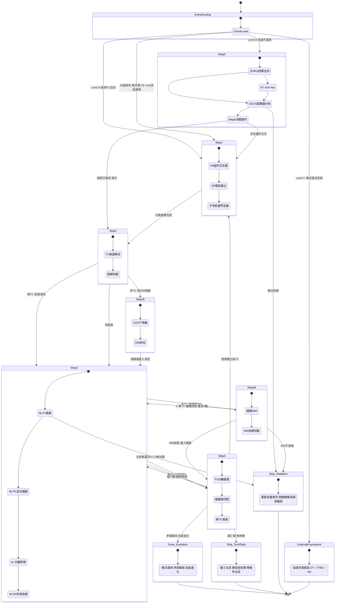

# 問題生命週期狀態機 (State Machine)

## 狀態說明

### 入口狀態

| 入口 | 觸發條件 | 導向 |
| :--- | :--- | :--- |
| Level C | 無法描述系統，問題本身不清晰 | 外部框架（DT / JTBD / AD） |
| Level A | 知道不滿意，但未能結構化問題 | Step 0 問題定向 |
| Level B | 能填 TC 造句，矛盾已可描述 | Step 1 功能建模 |
| 功能缺失 | 無矛盾，純功能缺失 | Step 1（SF-only 快速通道） |

### 核心步驟

| 步驟 | 主要活動 | 關鍵輸出 |
| :--- | :--- | :--- |
| Step 0 | 5Why / KT Is-Is Not / CECA | 根因鎖定或喊停 |
| Step 1 | FA 組件交互圖 / SF 模型 / 邊界定義 | 功能模型 |
| Step 2 | TC 候選解法 / 瓶頸判斷 | 矛盾清單 |
| Step 2b | OZ/OT 預篩 / SIM 評估 | 精簡後的矛盾集 |
| Step 3 | Px 搜索 / PC 造句 / 分離原理 / SF+科學效應 | 矛盾解法 |
| Step 3b | 精篩 SIM（最多 2 輪） | 收斂的矛盾集 |
| Step 4 | Px 分離驗證 / 複雜度四問 / 新 TC 檢查 | 原型驗證結果 |

### 終止狀態

| 終止狀態 | 觸發條件 | 意義 |
| :--- | :--- | :--- |
| **完成（進化）** | Step 4 矛盾解除 | 系統進化，問題根本解決 |
| **出貨（技術債）** | Step 4 補丁解 + 無時間 | 接受技術債，條件出貨 |
| **喊停（重新定義需求）** | CECA 無法收斂 / Px 耗盡 / SIM 不收斂 | 問題本身需要重新定義 |
| **外部框架** | Level C 入口 | 採用 DT / JTBD / AD 等外部方法 |
