# 知識庫整合點 — KB Integration Map

每個 Step 在哪個時機載入哪個 KB 檔案，以及輸入/產出。

```mermaid
flowchart LR
    subgraph "Step 1: 功能建模"
        S1_IN["輸入: 系統描述"]
        S1_OUT["產出:\n- 組件交互圖\n- SF 診斷\n- 改善/惡化描述"]
        S1_IN --> S1_OUT
    end

    subgraph "Step 2: TC + 候選方向"
        KB1["📂 01_39_parameters.md\n改善/惡化 → 參數對"]
        KB2["📂 02_contradiction_matrix.md\n參數對 → 原理編號"]
        KB3["📂 03_40_principles.md\n原理 → 具體化三問 → F/S"]
        S2_OUT["產出:\n每 TC 2-4 候選方向"]
        KB1 --> KB2 --> KB3 --> S2_OUT
    end

    subgraph "Step 3c: 分離策略"
        S3C_IN["輸入: PC 造句"]
        KB4["📂 04_separation_principles.md\n四個核心問題 → 分離原則"]
        S3C_OUT["產出:\n1-3 分離策略 + 控制方程"]
        S3C_IN --> KB4 --> S3C_OUT
    end

    subgraph "Step 3d: SF 標準解"
        S3D_IN["輸入:\n分離策略 + SF 狀態"]
        KB5["📂 05_76_standard_solutions.md\nSF 路由表 → 標準解大類"]
        SCI["科學效應導入:\nF → 物理效應\nS → 材料物性"]
        S3D_OUT["產出:\nF + S + OZ + OT\n具體物理方案"]
        S3D_IN --> KB5 --> SCI --> S3D_OUT
    end

    subgraph "SF-only 快速通道"
        SF_IN["輸入: SF 狀態 = 缺失/不足"]
        SF_KB["📂 05_76_standard_solutions.md\nSF 路由表直接定位"]
        SF_OUT["產出: 具體方案"]
        SF_IN --> SF_KB --> SF_OUT
    end

    S1_OUT -->|"改善/惡化描述"| KB1
    S1_OUT -->|"SF 診斷狀態"| S3D_IN
    S1_OUT -->|"SF 缺失/不足"| SF_IN
    S2_OUT -->|"TC → PC 轉換"| S3C_IN
    S3C_OUT -->|"分離策略"| S3D_IN
```

**KB 注入方式建議：**

| KB 檔案 | Token 量 | 建議注入方式 |
|:--------|:---------|:-----------|
| `01_39_parameters.md` | ~1,500 | 全量注入 |
| `02_contradiction_matrix.md` | ~15,000 (全量) / ~200 (單行) | RAG 按需：確定參數後僅注入相關行 |
| `03_40_principles.md` | ~4,000 | 全量注入 |
| `04_separation_principles.md` | ~1,000 | 全量注入 |
| `05_76_standard_solutions.md` | ~5,000 | 混合：SF 路由後僅注入對應大類 |
